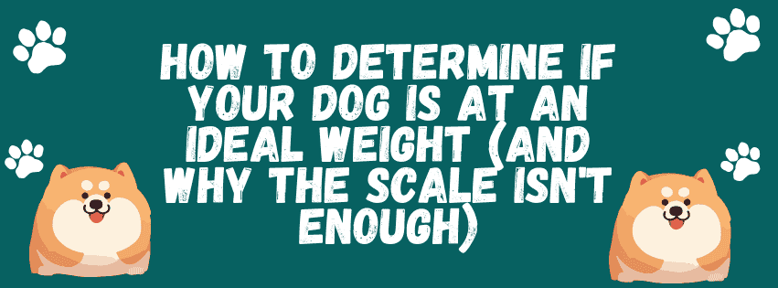

It can be quite hard to tell if your dog is at a healthy weight. If you ask relatives, friends, or other people at the dog park, you'll get very varied ideas about what a "healthy" dog looks like.

Pet obesity is becoming a huge health problem, so it's not safe to guess. So, how can you determine for sure if your dog is too thin, just right, or too heavy? Here are some real-world tips and veterinarian-approved rules to assist you figure out how healthy your dog really is.

## What is the Body Condition Score (BCS) for dogs?

The scale is not something that vets and dog health professionals use very often. Instead, they employ the Body Condition Score (BCS), which is a visual and physical test. A 50-pound dog could be dangerously lean or very overweight depending on its breed and structure. That's why the BCS focuses on three main physical traits:

- **The Rib Test:** You should be able to feel your dog's ribs without pushing too hard, but you shouldn't be able to see them sticking out (with a few breed exceptions).

- **The Waistline:** You should be able to see an inward bend (a waist) directly behind your dog's rib cage when you look down at them.

- **The Abdominal Tuck:** When you look at your dog from the side, their chest should be lower than their belly. Their belly should tuck up toward their back legs.

## Weight Considerations for Each Breed: One Size Doesn't Fit All

Many pet owners don't know what "healthy" looks like for certain breeds, which is a big mistake. A Bulldog would be in big trouble if they weighed what looked like a healthy amount.

### Should Labradors be Chubby?

No. Labs are very likely to become overweight, and what most people think is a "normal" weight for a Lab is actually very heavy. A healthy Labrador should have a clean waist and a slender body to safeguard their joints, which are under a lot of stress.

### What is the best weight for a pit bull?

Pitbulls and bulldog breeds are inherently good at sports. A Pitbull should have a lean, muscular body. Sadly, a lot of owners give them too much food to make them look "bulky," which can lead to serious obesity and joint injury.

### Why Should Dachshunds Stay Thin?

Dachshunds have long spines that are very easy to hurt, like with Intervertebral Disc Disease (IVDD). It is very important to keep Dachshunds on the lean side of the Body Condition Score. Extra weight puts hazardous pressure on their lengthy backs right away.

### Is it normal to see a dog's ribs?

For most breeds, ribs that may be seen imply that the dog is underweight. But for sighthounds like Greyhounds, Whippets, and some Pointers, having the final few ribs showing is absolutely normal for a healthy, athletic dog.

## The Biggest Mistake: "Food is Love"

People who think that feeding their dogs is the same as loving them are the main reason dogs get fat. Giving in to puppy-dog looks and giving them table scraps or too many goodies is not demonstrating love; it is actually shortening their life.

The best approach to connect with your dog is to play, train, or take a walk instead of giving them food.

## How to Keep an Eye on Your Dog's Weight at Home

Once a year at the vet's office is not enough to check your dog's Body Condition Score. Dogs can quickly gain or lose weight, especially when they go from being pups to adults or adults to seniors.

Vets say that you should check on them regularly by keeping note of what they eat, taking pictures of their waistline to compare, and noting little changes in their weight. But if you only rely on your memories or random pictures on your phone's camera roll, you won't be able to perceive the bigger picture.

This is when smart tracking becomes really important. The Vet Record app is a great tool for keeping an eye on your dog's health.

Vet Record lets you register your dog's exact weight, track how much food they eat each day, and keep a chronological visual diary of their Body Condition Score over time. This way, you don't have to guess if your dog appears a little heavier than last month. You can quickly pull up your dog's health history on the app, change their food, or send their full, organized profile to your physician if you see that they are losing their "abdominal tuck." It takes the guesswork out of caring for your pet and makes sure your dog stays at their healthiest weight all year long.

---

[Download Vet Record on Android](https://play.google.com/store/apps/details?id=vetrecord.app) · [Download Vet Record on iOS](https://apps.apple.com/us/app/vet-record-pet-health-track/id6756975927)
