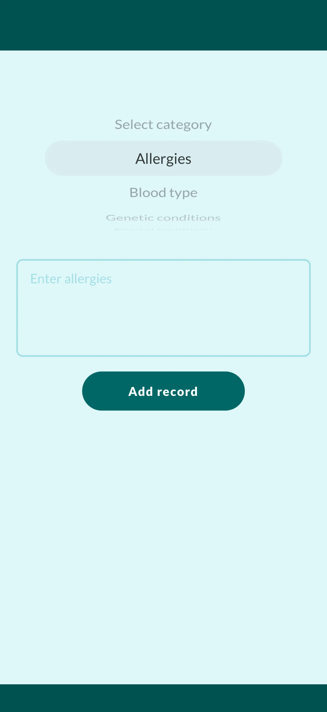
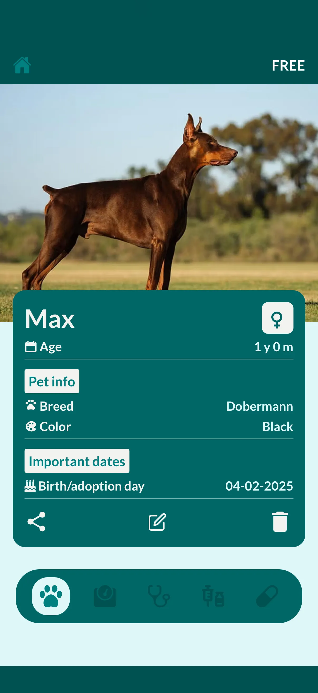
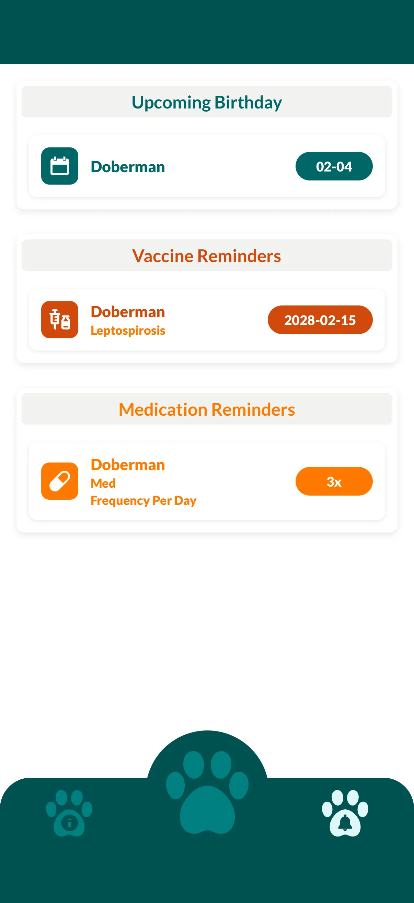
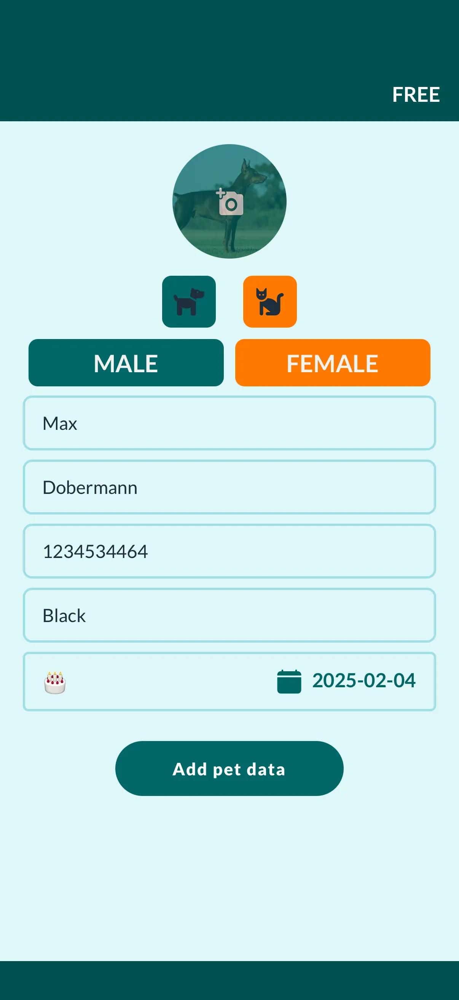

Simplify your pet parenting journey with Vet Record, the ultimate health organizer designed for dogs, cats, and all your furry friends. Whether you need a reliable vaccination tracker, a medication reminder, or a complete medical history log, we put your pet's wellness right in your pocket.

Join thousands of responsible pet owners who use Vet Record to ensure their pets live happier, healthier lives.

## Why Pet Parents Love Vet Record

### Organized Medical Records

Stop searching through piles of paper. Keep a digital archive of your pet's entire medical history.

- Store vet reports, lab results, and prescriptions
- Log allergies, weight changes, and growth charts
- Instantly export and share records with your veterinarian or groomer

### Smart Vaccination Tracker

Never miss a booster shot again. Keep your pet's immunity up to date effortlessly.

- Track core and non-core vaccines (Rabies, DHLPP, Bordetella, etc.)
- Receive automated alerts before vaccines expire
- Maintain a lifetime immunization log for travel or boarding

### Medication & Treatment Reminders

Managing chronic conditions or post-surgery care? We ensure you never miss a dose.

- Set recurring alarms for pills, flea/tick prevention, and heartworm meds
- Track dosage history to prevent double-dosing
- Perfect for pets with diabetes, epilepsy, or daily supplements

### Custom Care Alerts

Beyond medical needs, organize your pet's daily routine.

- Reminders for grooming, deworming, and check-ups
- Birthday and appointment notifications
- Create custom alerts for feeding or walking schedules

### Cloud Sync for Families

Pet care is a team effort. Sync data seamlessly across devices.

- **Family Sharing:** Mom, Dad, and the pet sitter stay on the same page
- **Cloud Backup:** Never lose your data, even if you change phones
- **Multi-Pet Support:** Manage profiles for all your dogs, cats, rabbits, or birds in one app

## Perfect For

- **Puppy & Kitten Owners:** Track growth and initial vaccine series
- **Senior Pets:** Manage complex medication schedules and vet visits
- **Multi-Pet Households:** Distinct profiles for every animal
- **Travelers:** Have vaccine proof ready on your phone instantly

---

Download Vet Record today and give your best friend the organized care they deserve! 🐾

[Download on Android](https://play.google.com/store/apps/details?id=vetrecord.app) · [Download on iOS](https://apps.apple.com/app/vet-record)
