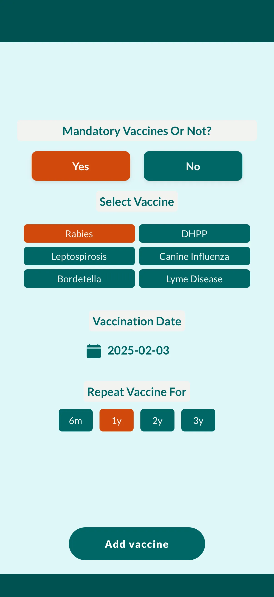
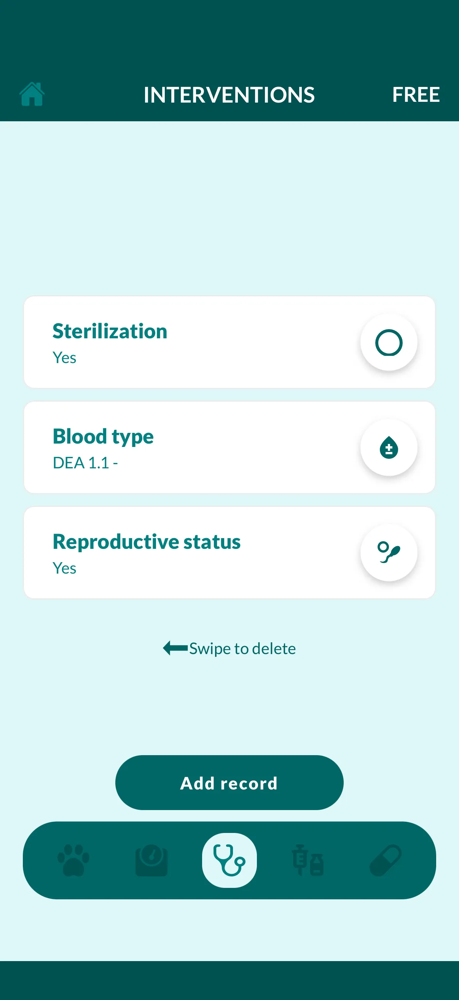

Keeping up with your pet's vaccinations, medications, and vet visits can be stressful. Vet Record helps you organize everything in one secure place — so you can focus on what really matters: your pet's health and happiness.

## 🩺 Simplify Pet Vaccination Management

Never worry about missing an important vaccination again. Vet Record tracks all your pets' vaccines and sends timely reminders before every due date. Stay on top of booster shots, annual checkups, and treatments effortlessly.

- **Smart vaccination reminders:** Automatic alerts for upcoming vaccines
- **Complete vaccination history:** Record dates, vaccine types, and your vet's details
- **Digital convenience:** Forget paper records — access everything instantly

## 🐕 Comprehensive Pet Health Organizer

Vet Record isn't just a vaccination tracker — it's your pet's complete health companion. Keep every detail about your pets' wellbeing safely stored and easy to find.

- **Medication tracking:** Log treatments, dosages, and schedules
- **Allergy and medical notes:** Record any sensitivities or conditions
- **Appointment management:** Keep track of vet visits and upcoming checkups
- **Pet birthdays:** Celebrate special days and never forget them again

## 🐾 Manage Multiple Pets with Ease

Have more than one furry friend? Vet Record makes it simple to manage multiple pets in one app. Each pet gets a personal profile with their unique health and vaccination history.

- View, edit, and organize individual records
- Switch between pets effortlessly
- Great for families, breeders, and animal shelters

## 🔒 Secure, Cloud-Based, and Always Accessible

Your pet's health data is safely encrypted and stored in the cloud, so you can access it anytime, anywhere, from any device. Vet Record puts privacy and reliability first.

- **Data security:** Advanced protection for all your information
- **Cloud sync:** Access your pet's records even if you change phones
- **Offline mode:** Review existing data anytime, even without internet

## 💡 Why Pet Owners Love Vet Record

Pet owners use Vet Record to stay organized, save time, and improve communication with veterinarians, groomers, and caregivers.

- No more missed vaccines or lost paperwork
- Easy sharing with vets, sitters, or boarding facilities
- Simple, clean design that's intuitive for all users

## 🌍 For Every Pet, Everywhere

Whether you have a dog, cat, rabbit, or parrot — Vet Record adapts to your pet's needs. Manage vaccinations, medications, and appointments for any type of animal in one place.

Vet Record helps responsible pet owners stay organized, confident, and stress-free. Keep your pets healthy, safe, and happy — all from your phone.

---

[Download Vet Record on Google Play](https://play.google.com/store/apps/details?id=vetrecord.app) · [Download on App Store](https://apps.apple.com/app/vet-record)
