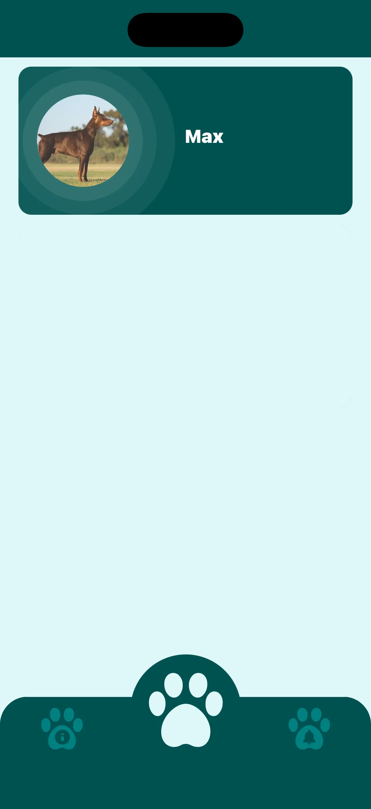
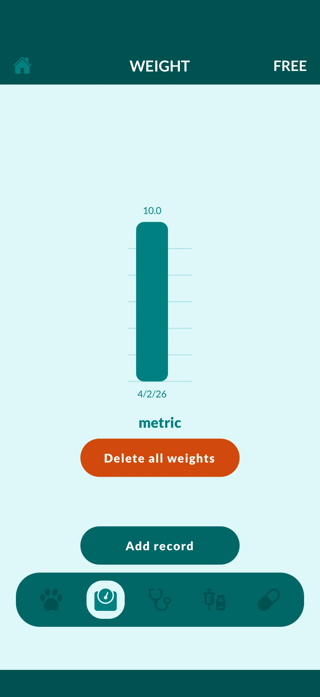
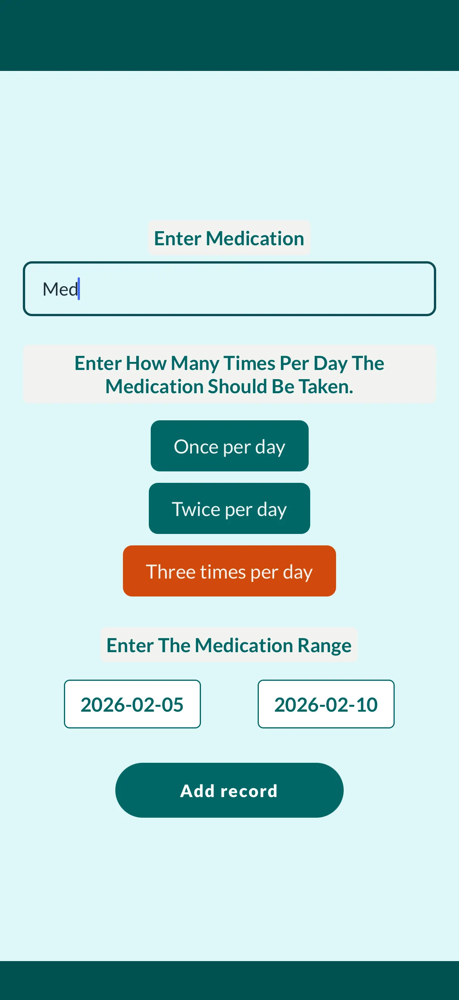
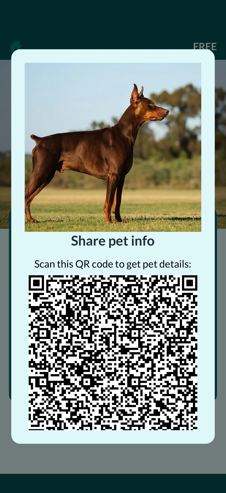
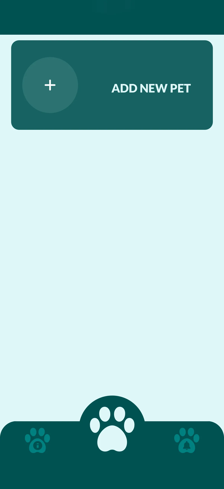

Welcome to Vet Record, the ultimate pet health tracker and medical logbook designed for responsible pet parents. Whether you are raising a playful puppy, a curious kitten, or caring for a senior dog or cat, managing their medical history has never been easier. Vet Record is a comprehensive pet care app that helps you organize, manage, and monitor your pet's vet records, medications, and vaccination schedules — all in one secure place. Say goodbye to lost paper files and hello to a digital veterinary passport right in your pocket.

## 📋 Digital Vet Records & Medical History

Log and store all vet visits, medical reports, and vet notes. Maintain a complete pet medical history for your dog, cat, rabbit, or bird. Attach important documents, lab test results, X-rays, and treatment plans. Easily share these comprehensive health records with your local veterinarian, pet groomer, or pet sitter.

## 💉 Vaccination Tracker & Immunization Reminders

Never miss a booster shot again! Track vaccination schedules for each pet. Set up automatic vaccine reminders for core and non-core vaccines (like Rabies, Bordetella, DHLPP). Monitor their complete immunization history and maintain a digital pet vaccine passport for travel, boarding, or daycare.

## 💊 Medication & Treatment Reminders

Managing a chronic condition or post-surgery care? Schedule precise medication reminders with dosage and timing. Track daily treatments, pills, flea and tick prevention, heartworm meds, and daily supplements. Get reliable alerts to stay on top of every dose, track recovery progress, and prevent double-dosing.

## 📈 Health Monitoring, Weight Tracker & Analytics

Log pet weight changes, symptoms, and vital health events. Keep a daily pet health diary or journal to track allergies, mood, or diet changes. View health trends and analytics to gain better insights into your pet's wellness. Identify patterns early and share them directly with your vet to ensure the best care.

## 🔔 Custom Pet Care Alerts & Organizer

Set personalized notifications for any pet care task. Create reminders for upcoming vet appointments, routine deworming, grooming sessions, or even daily feeding and walking schedules. Stay fully organized with real-time alerts and intuitive calendar tools.

## ☁️ Secure Cloud Sync & Multi-Device Access

Your pet data is safely backed up in the cloud. Access your pet's medical records from any device (Android or iOS), anytime. Sync records seamlessly with family members or pet sitters so everyone is on the same page. Enjoy peace of mind with 24/7 data availability.

## 👥 Perfect for Multi-Pet Families

Manage multiple pet profiles in one app! Track unique health records, distinct diets, and individual vet visits for each pet. The ideal pet manager for households with several dogs, cats, or other animals.

## 🌟 Unlock More with Vet Record Premium

Take your pet's care to the next level with our Premium features:

- **PDF Export & Share:** Instantly generate, export, and share detailed PDF medical reports.
- **QR Code Data Sharing:** Quickly share your pet's essential profile and emergency data with a simple QR code scan.
- **Unlimited Health Records:** Add limitless medical details, surgeries, and allergies.
- **Expanded Pet Limit:** Manage up to 10 distinct pet profiles in a single account.
- **Advanced Weight Tracking:** Store up to 90 weight entries for precise diet monitoring.

---

Download Vet Record today to simplify your pet parenting journey. Make sure your furry friends live longer, happier, and healthier lives with the best pet health tracker on Google Play!

[Download Vet Record on Android](https://play.google.com/store/apps/details?id=vetrecord.app) · [Download Vet Record on iOS](https://apps.apple.com/app/vet-record)
